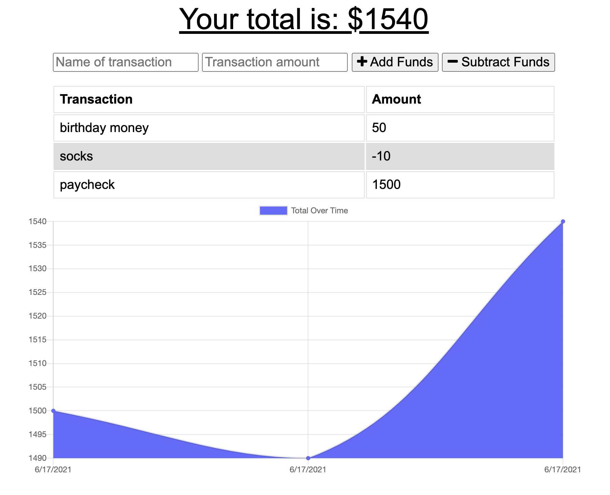

# Budget Tracker

<a href="https://opensource.org/licenses"></a>

## Table of Contents
* [Description](#description)
* [Installation Instructions](#installation-instructions)
* [Usage Information](#usage-information)
* [Contribution Guidelines](#contribution-guidelines)
* [License Information](#license-information)
* [Questions](#questions)

## Description
A progressive web app that allows a user to track expenses. The app leverages indexeDB to store data offline to be synced with the server later when the connection is once again active.

## Installation Instructions
Install the app by running ```npm install```

## Usage Information
Run the app locally by running ```npm start``` after installing, ensure mongodb server is running and configured in server.js or visit the [live demo](https://budget-tracker-n8blake.herokuapp.com/).



## Contribution Guidelines
If you wish to contribute, open an issue on GitHub

## License Information

<a href="https://opensource.org/licenses"></a>


		

## Questions
Email [hello@n8blake.com](mailto:hello@n8blake.com)
or create an issue on [Github](https://github.com/n8blake)  
